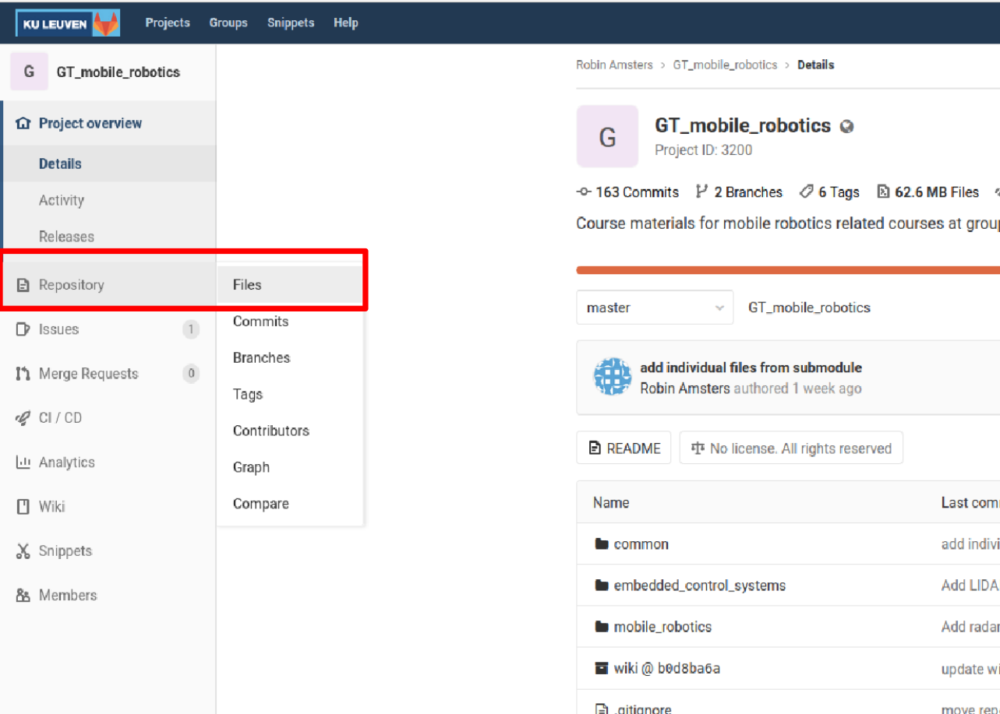
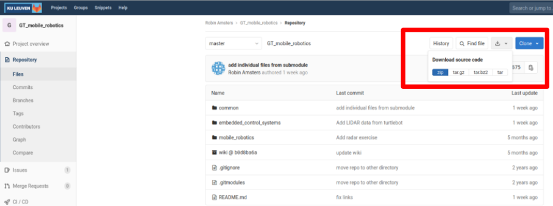

# Group T mobile robotics

Welcome to the group T mobile robotics gitlab! This repository contains example code for mobile robotics courses at KU Leuven campus group T, more specifically for the autonomous vehicles and embedded control systems courses. As well as documentation about this code and the robot platforms. To get started, take a look at the [wiki](https://www.mech.kuleuven.be/imp/?n=Main.Education), which contains additional information and documentation. 

Information per course:

- [Mobile robotics exercises](https://www.mech.kuleuven.be/imp/?n=EduAV.020MRExercises)

- [Embedded control systems experience](https://www.mech.kuleuven.be/imp/?n=EduECS.030Experiences)
  - [Manual](https://www.mech.kuleuven.be/imp/?n=EduECS.030SubManual) 

# Downloading the files

To download the files in this repository, on the left hand side, select repository -> files

Next, clock the download button and select .zip as the file extension

Download the files to your desired location, and unzip the files. Make sure all the files are on your MATLAB search path before executing any of the examples. You can add the entire folder to your search path by right clicking it in the MATLAB file explorer, and select 'add to path' -> 'selected folders and subfolders'.

Both this code repository is currently maintained by Robin Amsters (robin.amsters@kuleuven.be).

